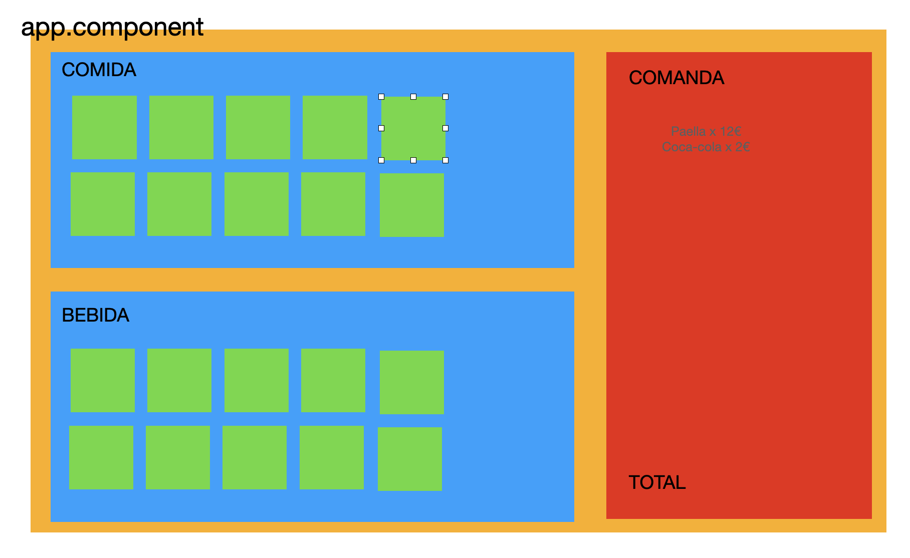

# CajaRegistradora



1 - Instalar Bootstrap
    npm install bootstrap

2 - Crear componentes: ListaProductos, Comanda

3 - Crear interface Producto (nombre: string, precio: number, imagen: string)

4 - Dentro de **app.component.ts** generamos los arrays de datos:

```javascript
arrComida: Producto[];
arrBebida: Producto[];
```

Dentro del constructor los inicializamos

```javascript
this.arrComida = [{nombre: 'chuletón', precio: 4, imagen: 'http://wwww..'}]
```

5 - Dentro de **app.component.html** definimos los componentes

```html
<lista-productos titulo="COMIDA" [productos]="arrComida"></lista-productos>
<lista-productos titulo="BEBIDA" [productos]="arrBebida"></lista-productos>
```

6 - En lista-productos.component.html, iteramos el array de **productos** y mostramos todas las imágenes

7 - ¡¡PRUEBA!! Cuando pulse en uno de los productos, mediante un console.log tengo que poder visualizar los datos del producto pulsado

8 - Mediante un **Output** enviar el producto pulsado al componente padre