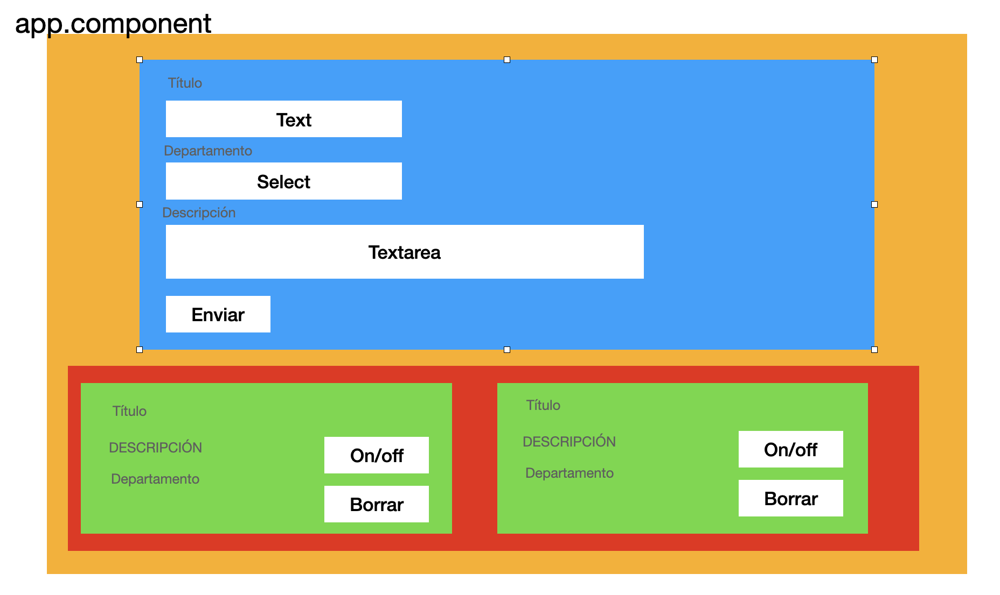

# Gestión de proyectos



- Instalar Bootstrap

- Incluir dentro de **app.module** (en el array de imports) el módulo **FormsModule**

- Crear interfaz Proyecto (titulo: string, departamento: string, descripcion: string, activo: boolean)

- Creación de componentes: Formulario, Lista, Detalle

## FormularioComponent

- Componente que muestra un formulario y cuando pulso el botón Enviar, **emite** hacia el padre el proyecto generado

```html
app.component.html
<formulario (proyectoCreado)="onProyectoCreado($event)"></formulario>
```

- Todos los nuevos proyectos empiezan con la propiedad **activo = false**

- Cuando el proyecto llegue al componente padre (app.component), lo almacenamos en un array

## ListaComponent

- Componente que recibe un **array de proyectos** y los lista

```html
app.component.html
<lista [arrProyectos]="proyectos"></lista>
```

## DetalleComponent

- Componente que recibe **un único proyecto** y lo muestra

```html
<detalle [proyecto]="XXXXXXX"></detalle>
```