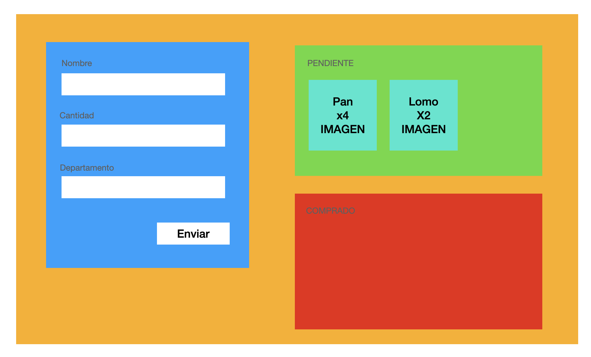

# Lista de la compra



1 - Instalar Bootstrap

2 - Creación interface Producto (nombre, cantidad, departamento)

3 - Creación de componentes: Formulario, ListaProductos, Detalle (opcional)

4 - Dentro de AppModule importamos FormsModule -> ngModel

```html
app.component.html

<formulario (productoCreado)="onProductoCreado($event)"></formulario>

<lista-productos 
    [productos]="productosPendientes"
    (productoSeleccionado)="onProductoSeleccionado($event)"
>
</lista-productos>
<lista-productos [productos]="productosComprados"></lista-productos>
```


