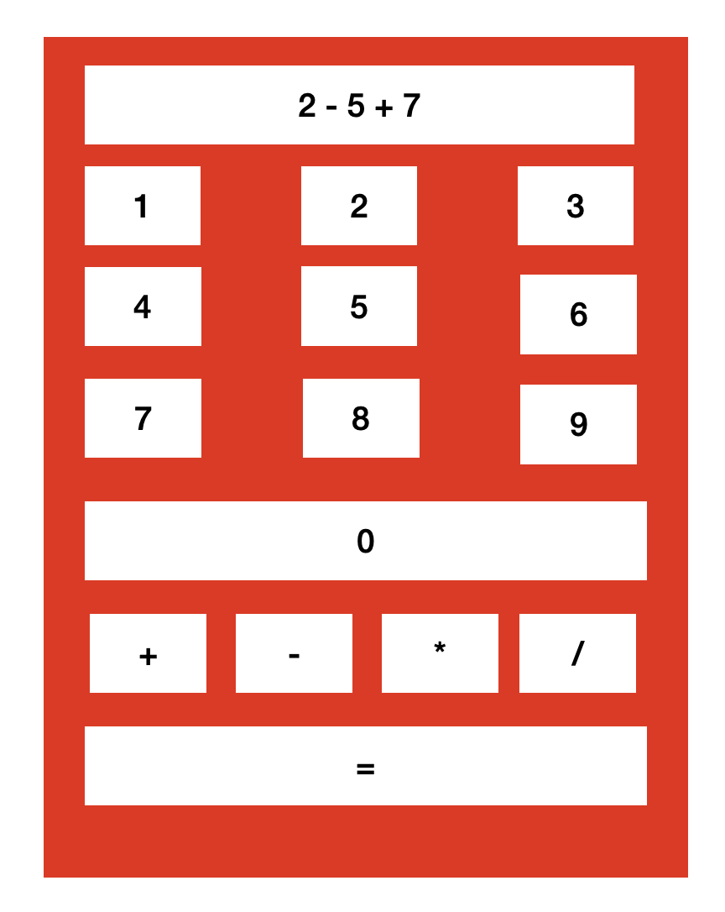

# Calculadora

1 - Generar el componente

```
ng generate component Calculadora --skip-tests
```

2 - En el HTML de la calculadora, generar el interfaz gráfico



3 - Crear un método que se ejecute para la pulsación de cada botón -> Diferenciar cada botón por medio del parámetro del método

4 - Dentro de este método recogemos la información del botón y lo concatenamos en el **resultado**

5 - Generar el método IGUAL. Función **eval**

```javascript
eval('3+4+5-3')
```