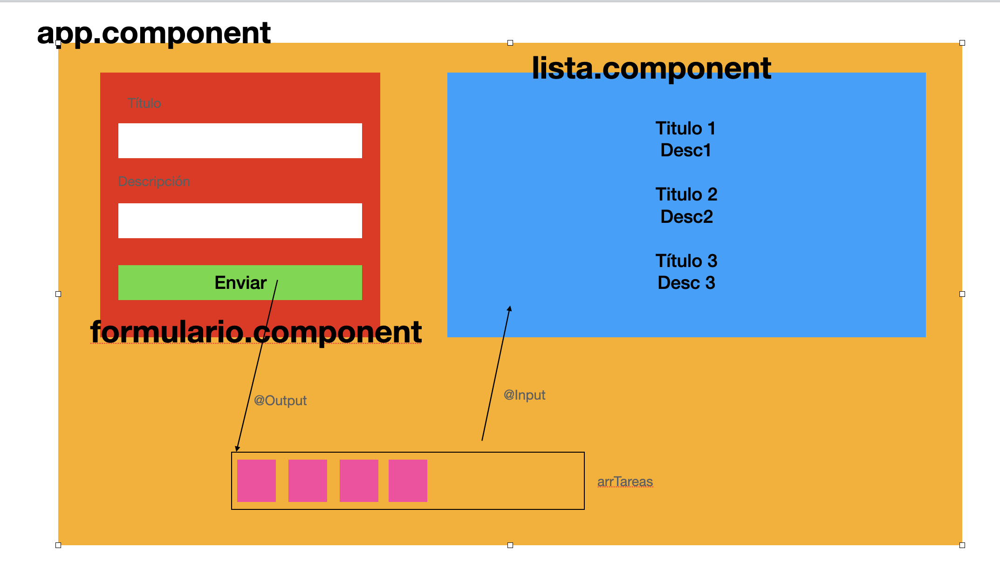

# TodoSimple



- Instalar Bootstrap
    - Lanzamos la instalación con **npm install bootstrap**
    - En **angular.json** dentro del array de estilos, colocamos la ruta (snippet)

- Creación de componentes: Formulario, Lista

- Creación interfaz -> Tarea (titulo, descripcion)

- Importar en **app.module** la librería FormsModule

## FormularioComponent

- Crear la interfaz (HTML)

- ¿Cómo lo vamos a usar?

```html
<formulario (tareaCreada)="onTareaCreada($event)"></formulario>
```

- Cuando se pulse el botón ENVIAR, emitamos a través del Output tareaCreada, la tarea.

```html
<lista [tareas]="arrTareas"></lista>
```